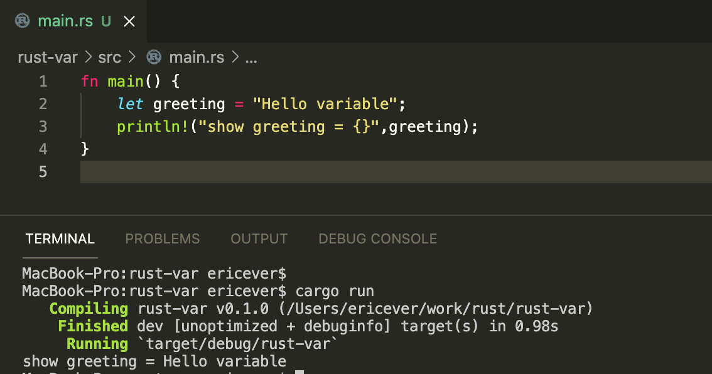

# 6.变量

> 变量的声明和js一样，但是却非常的不同

### 命名规则

- 大小写敏感
- 字母或者下划线开头，不能以数字开头
- 不能使用保留字

### 使用说明

1.  使用let声明一个变量
2.  默认情况下，声明的变量不具有枚举能力immutable (就是说赋值之后不能改变)，也就是说，一旦赋值就无法改变。
3.  如果想让声明的变量可以改变，需要使用 let mut name = ""; 来声明

### 例子1

> cargo run 会先编译再执行编译后的程序

### 例子2

变量重新赋值后报错了， 报错的原因在console上显示 “cannot assign twice to immutable variable”

### 例子3

使用mut修饰变量的声明，使变量变成可枚举类型； 报错问题解决

