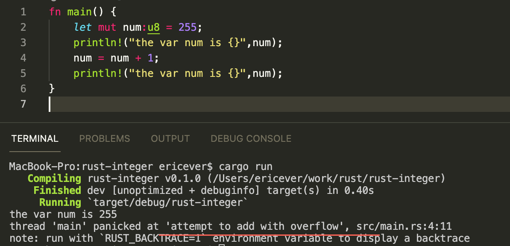

# 7. 数据类型

1. rust是静态类型的语言
> 就是说在编译器必须确定变量的类型
2. 内存中只能存储二进制数据
3. 任何东西都能用二进制表示，只有程序知道某一段二进制代表的是什么
> 举例说明 01010010 这段进制，既可以表示为一个整数82 也可以代表一个字符'R'; 具体代表的什么意思只有程序知道

### rust的基本数据类型

> 字符串和字符的数据类型不。 
> 另外：字符用单引号，字符串用双引号


### Integer 整型

为了表示整型数据，rust又提供了以下几种具体的类型来囊括整型数据


举例： 假设我们定义了一个变量num类型为u8， 首先赋值255，输出，然后又增加一位，再输出，结果没显示。



原因：  u8只支持0-255的整型数，超过这个范围的数字就越界了，在编译阶段被rustc识别，并提示错误。

但是，我们如果不设置u8类型，则正常输出 ,这是因为，默认的integer类型为i32 


程序中的代码和下面代码等同

```
fn main() {
    let mut num:i32 = 255;
    println!("the var num is {}",num);
    num = num + 1;
    println!("the var num is {}",num);
}
```

----

**声明变量时没有指定具体类型，rust都会设置默认的数据类型**

### float 浮点数据类型 

浮点数在rust中有两种数据可以处理 f32 和 f64， 默认的数据类型f64


