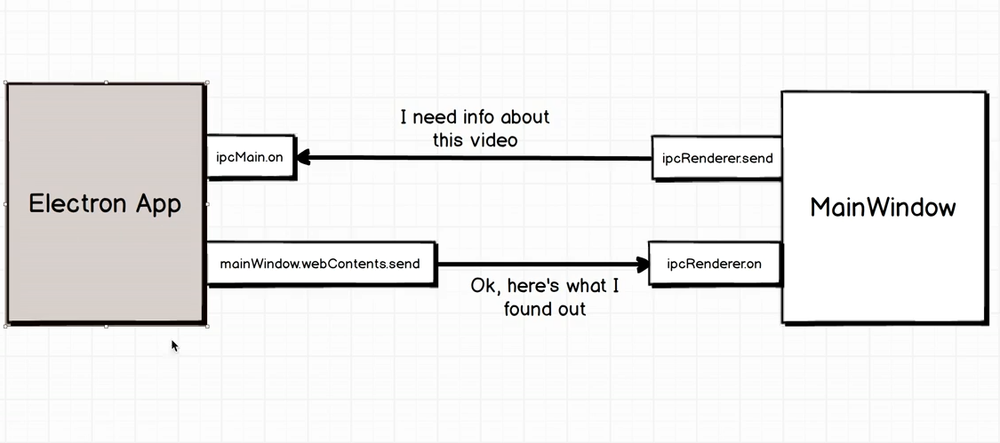

1，web端发消息

（1）web端向桌面端发送消息

	ipcRenderer.send("type", {}||'');
	
（2）桌面端接收消息
	ipcMain.on("type", (event,data)=>{
		//......
	});


2， 桌面端发消息

（1）桌面端发送消息

     browserWindow.webContents.send("type2",data);

（2）web端接收消息
	ipcRenderer.on("type2",(event,data)=>{
	
	});

### 以上两个过程需要注意， 发送的data里面不应包含function 否则会报错。
### 注意需要设置
```
new BrowserWindow(Object.assign({},{
      width: 400,
      height: 300,
      webPreferences: {
        preload: path.join(__dirname, 'preload.js'), //预加载脚本
        nodeIntegration: true, //允许nodejs   以下三句话，保证了web端也可以使用commonjs模块
        contextIsolation: false,
        enableRemoteModule: true //允许远程模块
      }

    }

```
### 在 Electron 中，只有在 app 模组的 ready 事件被触发后才能创建 BrowserWindows 实例。





