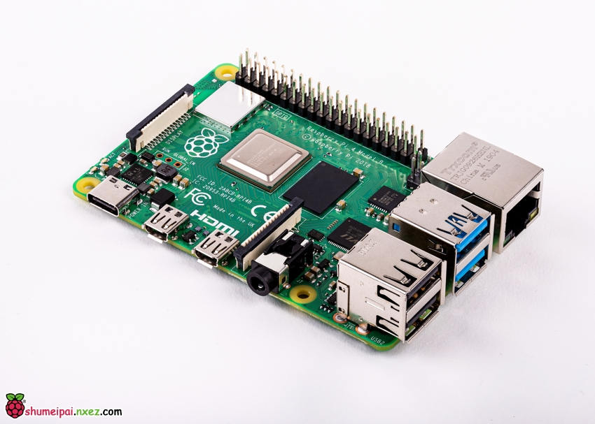
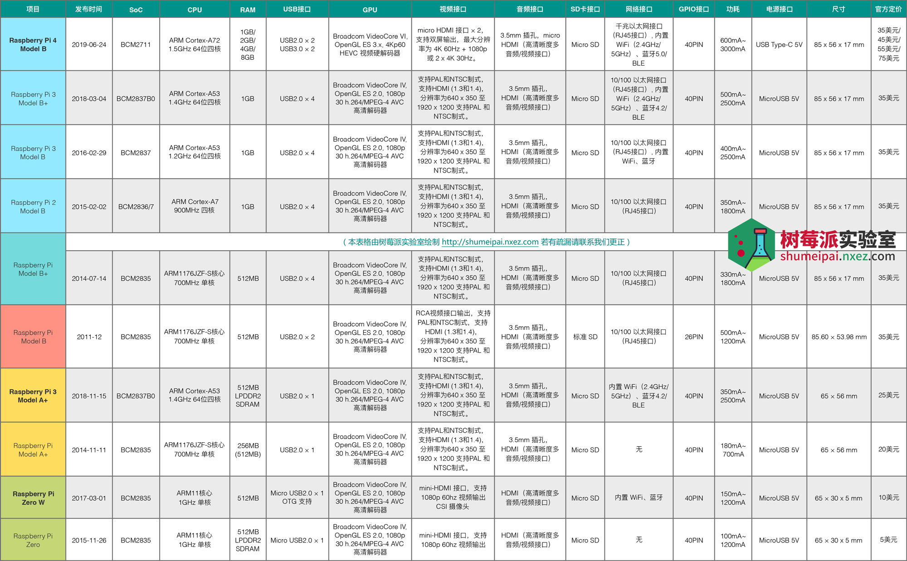

# 1. 树莓派简介

> 下文中涉及的图片来自树莓派实验室

## 一、树莓派简介

树莓派（Raspberry Pi）是尺寸仅有信用卡大小的一个小型电脑，您可以将树莓派连接电视、显示器、键盘鼠标等设备使用。
树莓派能替代日常桌面计算机的多种用途，包括文字处理、电子表格、媒体中心甚至是游戏。并且树莓派还可以播放高至 4K 的高清视频。
我们希望将树莓派推广给全世界的青少年电脑爱好者，用于培养计算机程序设计的兴趣和能力。

树莓派各版本发布时间和差异对照？

## 二、没有实时时钟？
树莓派没有实时时钟，关机后无法维持时钟的走时。没有连接网络的树莓派，每次开机时都需要手工设定时间。（连接网络的，开机时会自动联网获取时间）
添加实时时钟时钟电路，其实出奇的昂贵。因为一旦在板子上加入电池，空间和接口电路都会大大推高树莓派的造价。如果您的应用或电子制作有需要，可以考虑用GPIO扩展端口，自己在外部连接实时时钟电路。

## 三、不能增加内存吗？
内存是一个“扣”(焊接)在CPU/GPU上的PoP封装，无法拆卸。
实际上市面上有专门升级相关内存的小作坊，有损坏的封信。

